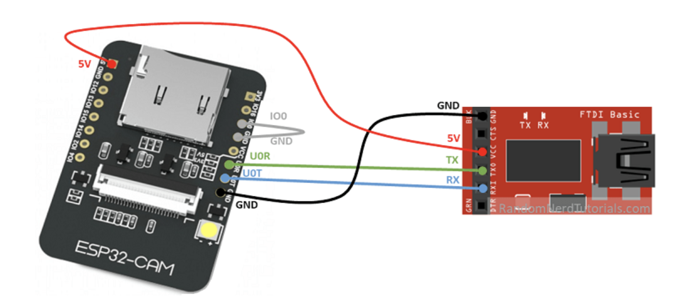

# Esp32Cam

Please connect your camera on the pins like following:

Please click [here](https://randomnerdtutorials.com/esp32-cam-video-streaming-face-recognition-arduino-ide/) for further instructions.

You'll need [PlatformIO](https://platformio.org/) to build, upload and monitor your code.

We used [ESP32QRCodeReader](https://github.com/alvarowolfx/ESP32QRCodeReader) as our library to read QR-Codes and send HTTP-Requests to our backend to trigger the pills dispenser.
